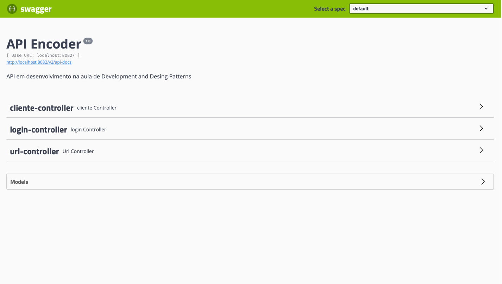

# API Encoder

   

## Tópicos

  • <a href="#Descrição do Projeto">Criação de cliente</a> •
  <a href="#tecnicas-e-tecnologias-utilizadas">Consultas de cliente</a> •
  <a href="#tecnicas-e-tecnologias-utilizadas">Login de cliente</a> •
  <a href="#abrir-e-rodar">Exclusão de cliente</a> •
  <a href="#acesso-ao-projeto">Criação de HASH</a> •  
  <a href="#ajustes-e-melhorias">Consultas de HASH</a> •
  <a href="#licenca">Exclusão de HASH</a> 

## Patterns

  • <a href="#Descrição do Projeto">Builder</a> •
  <a href="#tecnicas-e-tecnologias-utilizadas">Singleton</a> 

## Builder
O padrão Builder (Builder Pattern) é um padrão de projeto de software criacional (creational design pattern) que tem como objetivo separar a construção de um objeto complexo da sua representação, permitindo que o mesmo processo de construção possa criar diferentes representações.

Em outras palavras, o padrão Builder oferece uma maneira de construir objetos complexos passo a passo, permitindo que diferentes tipos de objetos possam ser criados usando o mesmo processo de construção. Isso torna o código mais flexível e modular, facilitando a manutenção e evolução do software.

O padrão Builder é particularmente útil quando você precisa criar objetos complexos que exigem muitos parâmetros ou quando você deseja criar diferentes variações de um mesmo objeto, mantendo o mesmo processo de construção.

## Singleton
Singleton é um padrão de projeto de software criacional que garante que uma classe tenha apenas uma instância e fornece um ponto de acesso global para essa instância.

Em outras palavras, o padrão Singleton garante que uma classe possa ter apenas uma instância durante a execução do programa e fornece um meio para acessar essa instância globalmente em toda a aplicação. Isso é útil quando uma única instância de uma classe é necessária para coordenar ações em todo o sistema.

O padrão Singleton é amplamente utilizado em situações em que apenas uma instância de uma classe é necessária, como em objetos de conexão com banco de dados, objetos de log e gerenciadores de recursos.

Ao usar o padrão Singleton, é possível controlar o acesso à instância única e garantir que ela seja inicializada apenas uma vez, além de garantir que a instância seja facilmente acessível em toda a aplicação.

O padrão Singleton pode ser implementado de várias maneiras, como usando um construtor privado, uma variável estática privada e um método público estático para acessar a instância.
## Descrição do Projeto

Aplicação Java com SPRING BOOT, desenvolvida na aula de Development and Design Patters da 4a etapa do curso de Sistemas de informação da Univem.

 * API gerando HASH a partir da URL informada

 * Balanceador de carga (Nginx)

 * Cache (spring-boot-starter-cache e Redis)

 * Banco de dados (H2)

## Integrantes da equipe

Gabriel Menoi - RA:602655

Gabriel Mielo - RA:601128

Matheus Araújo - RA:603236

Tiago Santos - RA:603181

Vitor Studzieski - RA:608661
